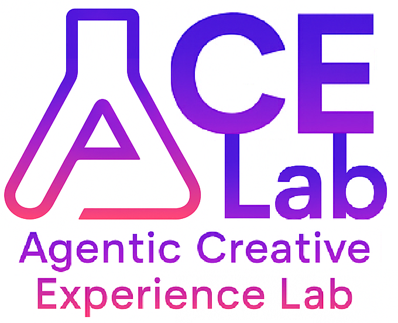

# ACE Lab — Agentic Creative Experience Lab



A compact creative-tools platform that pairs real-time shaders with agentic AI. Load images or video, apply from-scratch GLSL effects, record clips, and let specialized agents propose looks, optimize performance, compose transitions, and keep outputs on brand.

## Highlights

- **Agentic co-pilot**
  - Creative Brief Agent: turns a prompt or reference image into a look profile and starter params
  - Shader Architect Agent: proposes shader blocks and tunable schemas for the target device
  - Performance Optimizer Agent: profiles GPU time, reduces samples, and produces mobile-safe presets
  - Transition Composer Agent: analyzes media to auto-time transitions and build a keyframe timeline
  - Preset Curator Agent: learns from edits and recommends next presets
  - Policy Agent: brand and export rules with clear violations and one-click fixes
  - Knowledge/RAG Agent: retrieves shader tips and citations from a local corpus
  - QA Agent: sweeps presets, flags flicker or banding, and attaches an artifact report

- **Creative toolkit**
  - Filters: Halftone, VHS/aberration with scanlines and grain
  - Transition: Cross-zoom with tunable samples and strength
  - Text effect: Wave with outline using a canvas text atlas
  - Live inputs, presets, FPS HUD, and WebM clip recording

## Quick start

```bash
# Create the app
npm create vite@latest ace-lab -- --template react-ts
cd ace-lab
npm i

# Add the main component
# Save your component file as: src/IGCreativeLab.tsx
# Replace src/App.tsx with:
